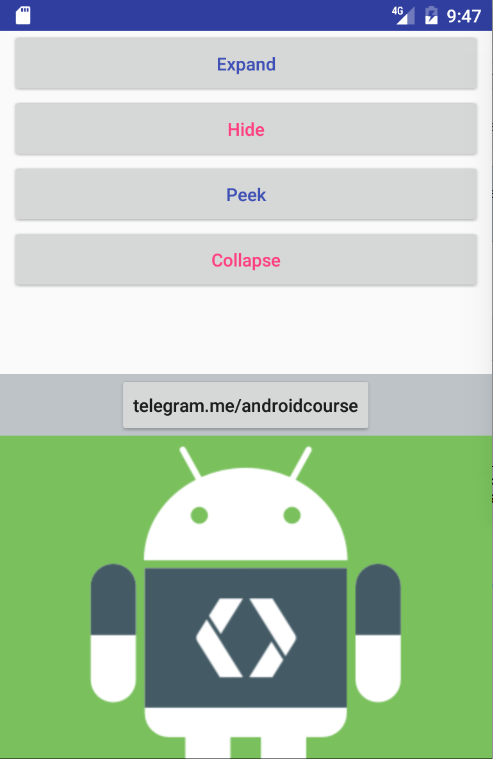

# BottomSheet in Android

Modal BottomSheet             |  Persistent BottomSheet
:-------------------------:|:-------------------------:
  |  

## What is BottomSheet ?

Bottom sheets are views that slide up from the bottom of the screen to reveal more content. This content can be anything, depending on the individual application. Bottom sheets have been used for menus, the display of more data and information, in the place of dialogs, and can also be used to show deep linked content from other apps.

## How to implement the BottomSheet in Android?
Based on `Material Design` guideline, there are `two types` of bottomsheet components :

1- `Modal` : which present a bottom sheet like a dialog, where pressing the back button dismisses the bottom sheet. This is excellent for presenting deep-linked content from other apps.

2- `Persistent` : which present bottom sheets as just another view on the displayed activity/fragment. These are usually used to show menus and other supporting content for an app.

`The difference` between these two implementations is that `Persistent` bottom sheets are displayed at the same elevation as an app, whereas `Modal` bottom sheets are at a higher elevation than the app’s content. When used, the main app dims to indicate the shift of focus.

`The Modal Implementation in Android` can be achieved by showing a `BottomSheetDialogFragment` and the `Persistent one by applying the BottomSheetBehavior` to part of a layout in an activity or fragment.

